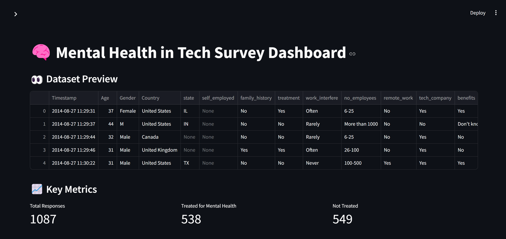

# 🧠 Mental Health in Tech Dashboard

An interactive data analysis dashboard built with **Streamlit**, **Pandas**, **Plotly**, and **Seaborn** to explore mental health trends in the tech industry.



---

## 📊 Features

- 📥 Upload & filter survey data (`survey.csv`)
- 🎯 **Interactive filters**: Age range, gender, and treatment status
- 📈 **Visual insights**: Bar charts, pie charts, histograms, choropleth maps
- 🌍 **Global map** showing treatment distribution by country
- ☁️ **Word cloud**: Common phrases from benefit descriptions
- 📥 **CSV download** of filtered survey data

---

## 🛠️ Tech Stack

| Tool         | Use                                |
|--------------|-------------------------------------|
| Streamlit    | Web app framework                   |
| Pandas       | Data wrangling                      |
| Plotly       | Interactive & animated visualizations |
| Seaborn      | Statistical plots & heatmaps        |
| Matplotlib   | Plotting utility for fine control   |
| WordCloud    | NLP-based word frequency visual     |

---

## 🚀 Getting Started

### 1. Clone the repo

```bash
git clone https://github.com/amourrxniah/Portfolio.git
cd Data Analysis Dahboard
```

### 2. Install requirements

```bash
pip install -r requirements.txt
```

### 3. Run the app

```bash
streamlit run app.py
```

---

## 📁 Dataset

The app uses a mental health in tech survey dataset from `https://www.kaggle.com/datasets/osmi/mental-health-in-tech-survey` (`survey.csv`). 

---

## 📌 Notes

- The dashboard automatically updates visualizations when filters are applied.
- Best viewed in desktop layout for full visual experience.

---

## 🙌 Credits

- This project uses the [Mental Health in Tech Survey](https://www.kaggle.com/datasets/osmi/mental-health-in-tech-survey) dataset provided by OSMI (Open Sourcing Mental Illness) on Kaggle.  
- All credit for the dataset goes to OSMI and the contributors of the survey.
- Streamlit Community and contributors ❤️

---
